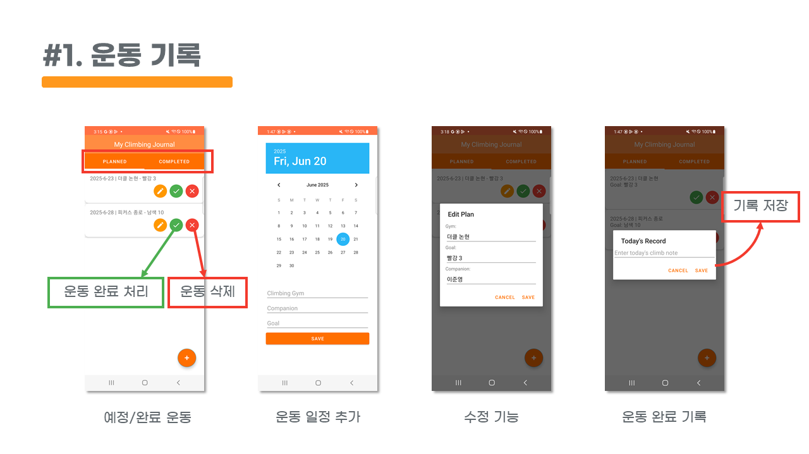
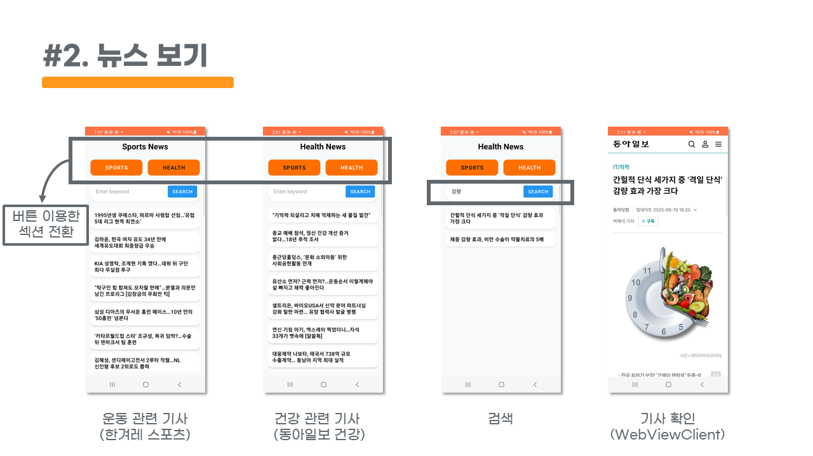
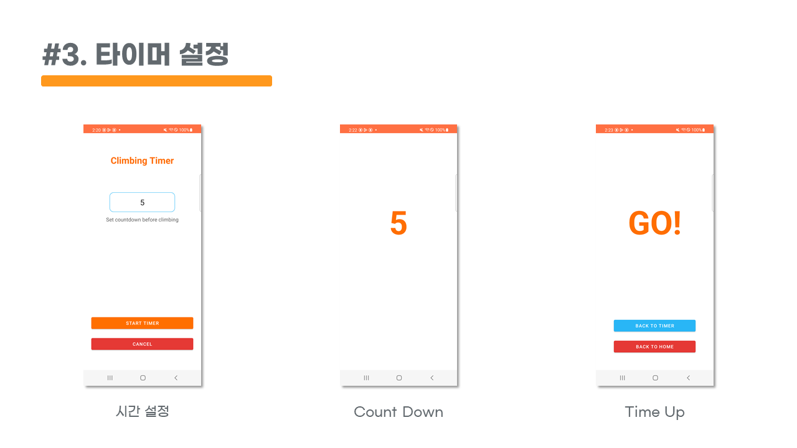
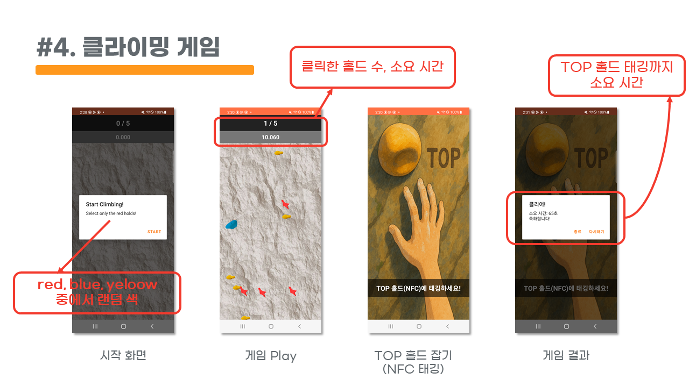
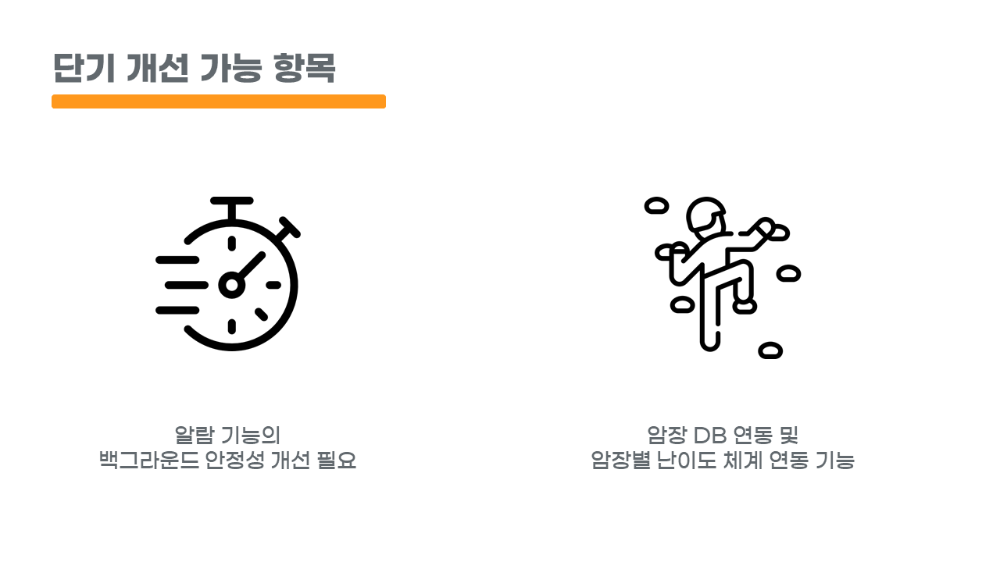
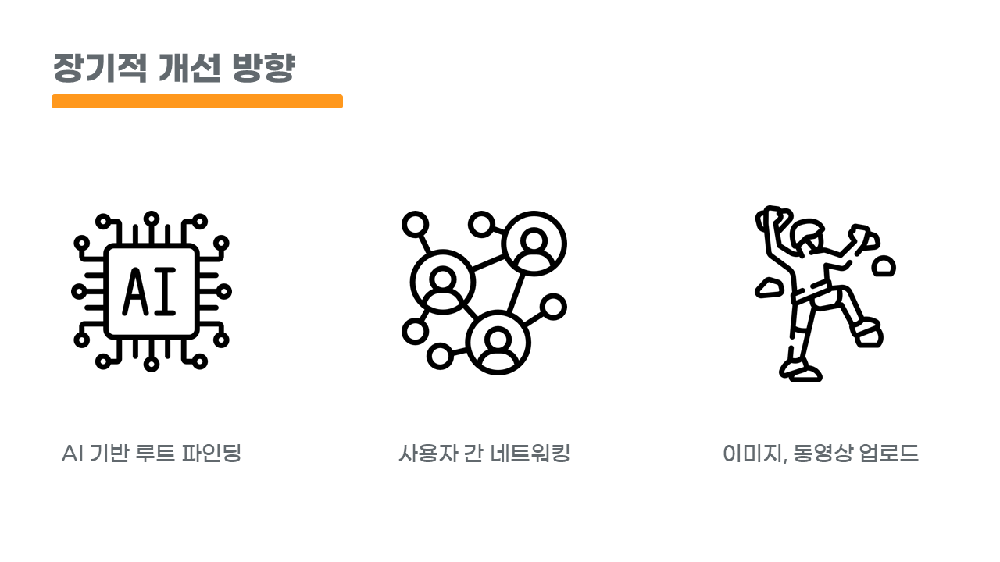

# CLIMBFIT (Android 통합 프로젝트)


## 📄 프로젝트 개요

**CLIMBFIT**은 클라이밍을 즐기는 사용자를 위한 자기관리 통합 앱입니다. 

하나의 앱에서 개인별 클라이밍 운동 일정 및 목표를 설정하면서, 운동 계획에 따른 알람 설정과 완료된 운동 기록 열람까지 지원합니다. 클라이머에게 필요한 기능들을 통합하여 제공함으로써 **운동 계획 수립 → 실행(알람/게임) → 기록 관리**의 사이클을 쉽게 관리할 수 있도록 돕습니다.

---

## 📊 상세 기능 소개

### 1. 운동 계획 생성 및 관리
 사용자가 자신의 클라이밍 운동 계획(루틴)을 앱에 추가하고 관리할 수 있습니다. 계획을 추가하면 *PLANNED* 목록에 표시되고, 완료 시 *COMPLETED* 목록으로 이동합니다.
각 운동 계획마다 **목표를 설정**하고 **완료 여부를 기록**할 수 있습니다. 사용자는 완료한 계획의 세부 정보를 열람하고, 목표 달성 결과를 요약 확인할 수 있습니다.




### 2. 운동 관련 News 탭
운동 뉴스나 운동 팁 등 유용한 정보를 제공하는 건강 정보 탭이 포함되어 있습니다.




### 3. 알람 및 타이머 기능
운동 루틴 실행을 도와주는 알람 기능을 제공합니다. 사용자가 운동 시간을 예약하면 지정된 시간에 알림이 뜨고, 카운트다운 타이머로 인터벌 타이밍도 지원합니다. 타이머 의 역할은 아래와 같습니다.
  - 등반 후 휴식 시간 설정을 통해 규칙적인 운동 시간 유지
  - 등반 제한 시간 설정을 통한 민첩성/순발력 향상에 활용




### 4. 클라이밍 미니 게임
재미 요소로 클라이밍 게임을 포함하고 있습니다. 사용자는 게임을 통해 클라이밍 동작을 게임화하여 재미있게 연습하거나 휴식 시간에 즐길 수 있습니다. TOP 홀드에 합손하는 것을 NFC 태깅으로 활용하여, NFC 태그의 위치를 옮겨가며 게임을 즐길 수 있습니다.




---

## 🛠️ 기술 스택
[](https://skillicons.dev)

- **주요 언어:** Java
- **아키텍처:** Activity & Fragment 기반 MVC/MVVM 패턴
- **UI 라이브러리:** AndroidX, Material Design, View Binding
- **알람 기능:** AlarmManager, BroadcastReceiver
- **테스트:** Unit Test, Instrumentation Test 기본 구조 포함
---

## 🔧 프로젝트 폴더 구조

```plaintext
climbfit/
├── android_project/               # Android Studio 프로젝트 루트
│
│── app/                           # 앱 모듈
│   ├── build.gradle.kts           # 모듈 빌드 설정
│   └── src/
│       ├── main/
│       │   ├── java/com/scsa/myproject/   # 전체 소스코드
│       │   │   ├── activity/               # 주요 화면(Activity) 클래스
│       │   │   │   ├── MainActivity.java          # 메인 화면 (로고, 초기 화면)
│       │   │   │   ├── TodoActivity.java         # 운동 계획 메인 화면
│       │   │   │   ├── AddPlanActivity.java      # 운동 계획 추가 화면
│       │   │   │   ├── DetailActivity.java       # 운동 계획 상세 화면
│       │   │   │   ├── CountdownActivity.java    # 운동 타이머 화면
│       │   │   │   ├── AlarmActivity.java        # 알람 설정 화면
│       │   │   │   ├── ClimbingGameActivity.java # 클라이밍 미니게임
│       │   │   │   ├── TopHoldActivity.java      # 클라이밍 Top 홀드 미니게임
│       │   │   │   └── ParserMainActivity.java   # 클라이밍 뉴스 / 정보 탭
│       │   │   ├── adapter/
│       │   │   │   └── PlanAdapter.java          # 운동 계획 RecyclerView 어댑터
│       │   │   ├── fragment/
│       │   │   │   ├── PendingFragment.java      # 진행 중인 운동 계획 리스트
│       │   │   │   └── CompletedFragment.java    # 완료된 운동 계획 리스트
│       │   │   ├── model/
│       │   │   │   └── ClimbingPlan.java         # 운동 계획 데이터 모델
│       │   │   ├── alarm/
│       │   │   │   ├── AlarmReceiver.java        # 알람 브로드캐스트 수신
│       │   │   │   └── AlarmMainActivity.java    # 알람 메인 관리 화면
│       │   │   └── dialog/
│       │   │       └── ResultDialog.java         # 운동 완료 팝업 다이얼로그
│       │   ├── res/                      # 리소스 폴더 (레이아웃, 이미지 등)
│       │   │   ├── layout/               # 화면 UI 레이아웃 XML
│       │   │   ├── drawable/             # 이미지 리소스 (로고, 배경, 게임 이미지)
│       │   │   ├── raw/                  # 음악/효과음 파일 (bgm.mp3, mouse_scream.mp3 등)
│       │   │   └── values/               # 색상, 테마, 문자열 리소스
│       │   └── AndroidManifest.xml       # 앱 전체 권한 및 컴포넌트 선언
│       ├── test/                         # Unit Test
│       └── androidTest/                  # Instrumentation Test
│
├── build.gradle.kts               # 프로젝트 레벨 빌드 설정
├── settings.gradle.kts            # 모듈 포함 설정
├── gradle/
│   ├── wrapper/                   # Gradle 버전 관리
│   └── libs.versions.toml         # 라이브러리 버전 관리 (버전 카탈로그)
├── gradlew                        # Gradle 래퍼 (유닉스)
├── gradlew.bat                    # Gradle 래퍼 (Windows)
├── .gitignore                     # Git 무시 목록
└── climbfit_presentation.pptx     # 프로젝트 발표 자료
```

## 💡 실행 방법

### Android 앱 실행

1. GitHub 저장소를 클론 후 Android Studio에서 `android_project` 폴더를 열어주세요.
2. **minSdkVersion 24 (Android 7.0 Nougat)** 이상에서 동작합니다.
3. Internet 연결 후 Gradle 동기화를 완료합니다.
4. 실행 ▶️ 버튼으로 빌드 및 에뮬레이터/디바이스에서 앱 실행.

---

## 📅 개발 기간

* 2025년 6월 SCSA Android 통합 프로젝트 (4일 집중 개발)

## 개선 방향




---

## 🔗 기타

* **UI/UX 일관성:** Material Design 테마 및 View Binding 적용으로 깔끔하고 일관된 UI 구성
* **모듈화된 구조:** 기능별 클래스 분리, 유지보수성 높은 구조
* **개발 생산성:** 버전 카탈로그와 View Binding 활용
* **기능 완성도:** 알람, 게임, 운동 기록 등 클라이밍에 특화된 다양한 기능을 통합 제공
